## Configure the STM32 Device and Project
### Configure the Device

1. The "Clock Configuration" tab allows for clock timing configuration. Here we will set the HCLK (MHz) setting to the maximum supported for the device we are using. Click on the "Clock Configuration" tab. Set the HCLK to the maximum supported value of the device, which in this case is 216 MHz.

<table><tr><td>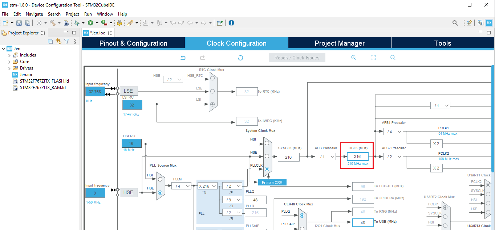</td></tr></table>

2. The "Pinout & Configuration" tab is where most of the configuration of the device will me made. Here we will enable our Real Time Operating System (RTOS) and our Lightweight Internet Protocol (LWIP) stack. We will also define some memory and stack-size settings. Click the "Pinout & Configuration" tab. Select the "System Core" category and the "RCC" subcategory. Set the "High Speed Clock (HSE)" to the "Crystal/Ceramic Resonator" option.

<table><tr><td>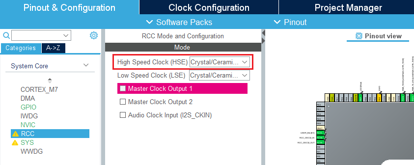</td></tr></table>

3. When using FreeRTOS, the Timebase Source should be other than the default "SysTick". Select the "SYS" subcategory and change "Timebase Source" to the "TIM6" option.

<table><tr><td>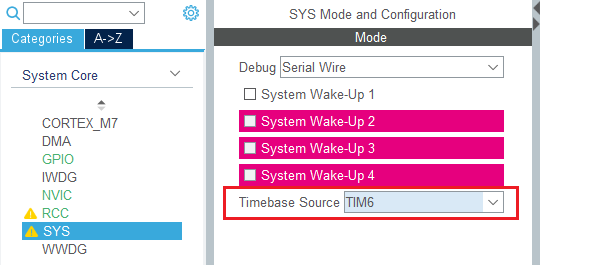</td></tr></table>

4. We will not use any USART on the board. Select the "Connectivity" category and the "USART3" subcategory. Set the "Mode" to the "Disable" option.

<table><tr><td>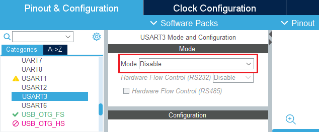</td></tr></table>

5. We will not use the USB "On-the-go" (OTG) full-speed feature. Select the "USB_OTG_FS" subcategory. Set the "Mode" to the "Disable" option.

<table><tr><td></td></tr></table>

6. We'll use FreeRTOS as our operating system. Select the "Middleware" category and the "FREERTOS" subcategory. Set "Interface" to the "CMSIS_V2" option.

<table><tr><td>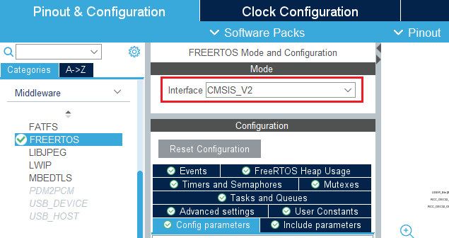</td></tr></table>

7. We hve 512KB of RAM on our board. We're going to configure the device RAM at 256KB though. On the "Config parameters" tab, set "TOTAL_HEAP_SIZE" to "262144" bytes. This corresponds to 256KB.

<table><tr><td>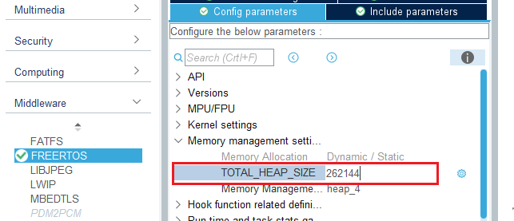</td></tr></table>

8. We want FreeRTOS to provide a handler for a stack overflow condition. On the "Config parameters" tab, in the "Hook function related defintions" section, set "CHECK_FOR_STACK_OVERFLOW" to "Option1".

<table><tr><td>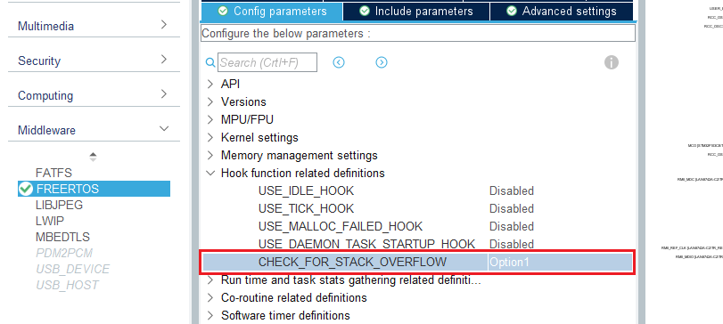</td></tr></table>

9. We will use both FreeRTOS and LWIP middleware. Each of them includes a distinct errno.h header. To avoid them having different values, on the "Config parameters" tab, in the "Added with 10.2.1 support" section, set "USE_POSIX_ERRNO" to "Enabled".

<table><tr><td>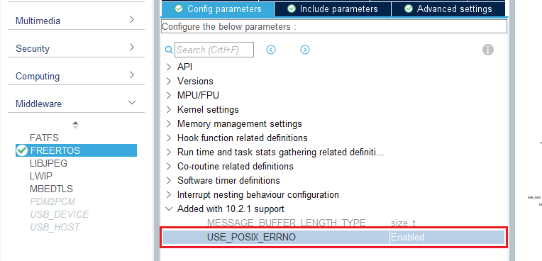</td></tr></table>

10. We will perform calls to new/delete or malloc/free. On the "Advanced settings" tab, set "USE_NEWLIB_REENTRANT" to "Enabled".

<table><tr><td>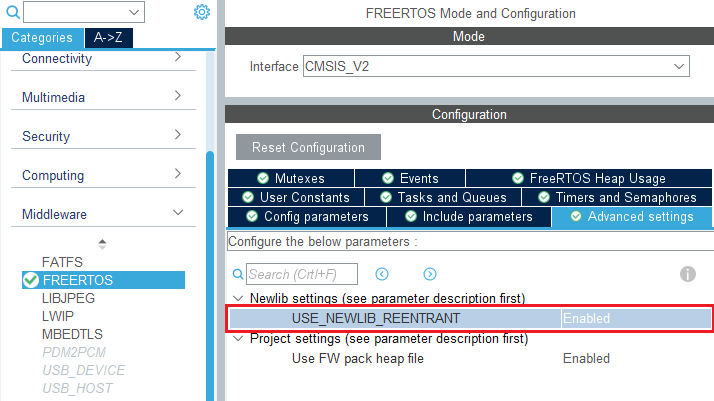</td></tr></table>

11. Our call stack will exceed the default size. On the "Tasks and Queues" tab, click on the "Stack Size (Words)" value for "defaultTask" and change the value from 128 to 256.

<table><tr><td>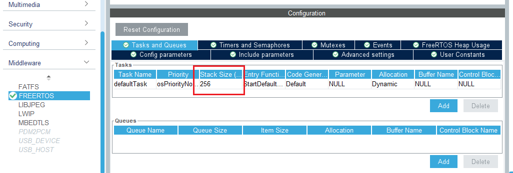</td></tr></table>

12. On the "Mutexes" tab, add the "myMutex01" dynamic mutex.

<table><tr><td>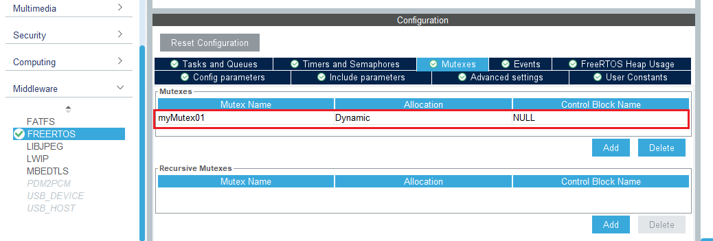</td></tr></table>

13. On the "Timers and Semaphores" tab, add the "myBinarySem01" binary semaphore.

<table><tr><td>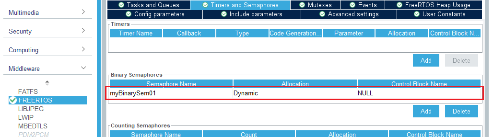</td></tr></table>

14. In th e "Middleware" section, select the "LWIP" category item. Check the "Enabled" check box.

<table><tr><td>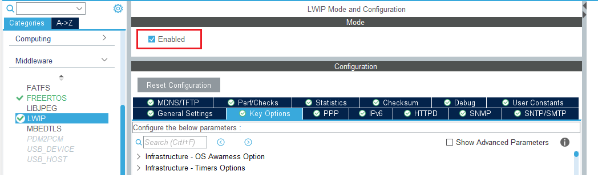</td></tr></table>

15. We'll expect file descriptors used for sockets to be non-zero. On the "Key Options" tab, set "LWIP_SOCKET_OFFSET" to 1.

<table><tr><td>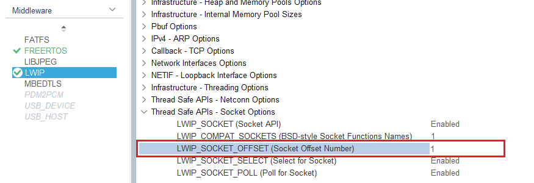</td></tr></table>

16. We'll test with a static network configuration first. On the "General Settings" tab, set "LWIP_DHCP" to "Disabled". Then, set "IP_ADDRESS", "NETMASK_ADDRESS" and "GATEWAY_ADDRESS" appropriately for your network. We can return and enable DHCP after testing a static configuration.

<table><tr><td>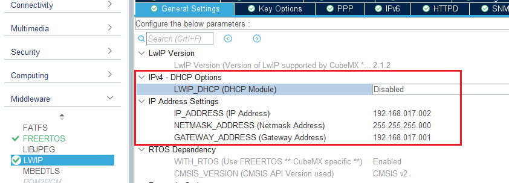</td></tr></table>

17. Click on the save icon or use the File|Save menu option or press Ctrl+S to save the project IOC file. When the IOC file is saved, the Device Configuration Tool will automatically generate code for the project. If prompted whether to generate code, answer Yes. Close the .ioc file.

<table><tr><td>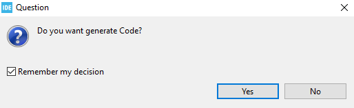</td></tr></table>

18. If prompted to open the C/C++ perspective, answer Yes.

<table><tr><td>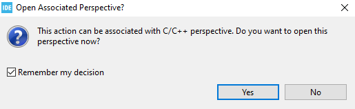</td></tr></table>

### Configure the Project Files

19. Open the "Project Explorer" window. Locate the file "lwipopts.h" in the LWIP/Target folder. Open the lwipopts.h file and define the SO_REUSE symbol with a value of 1.

<table><tr><td>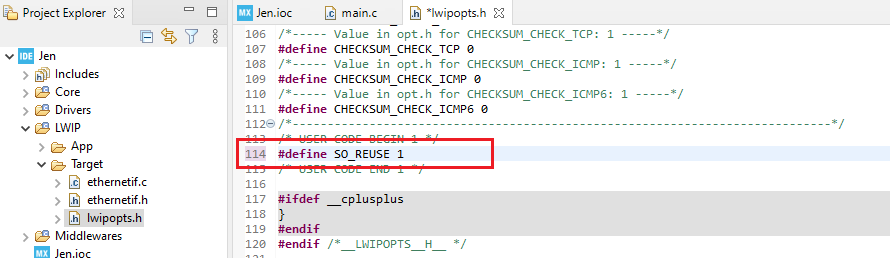</td></tr></table>

20. Locate the file "ethernetif.c" in the LWIP/Target folder. Open the file "ethernetif.c". Change the value of "INTERFACE_THREAD_STACK_SIZE" to 512.

<table><tr><td>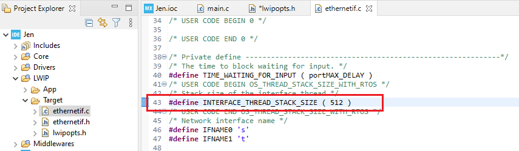</td></tr></table>

21. Add sample logic to the infinite loop in the StartDefaultTask function to exercise development board LEDs. Save changes to all edited files.

<table><tr><td>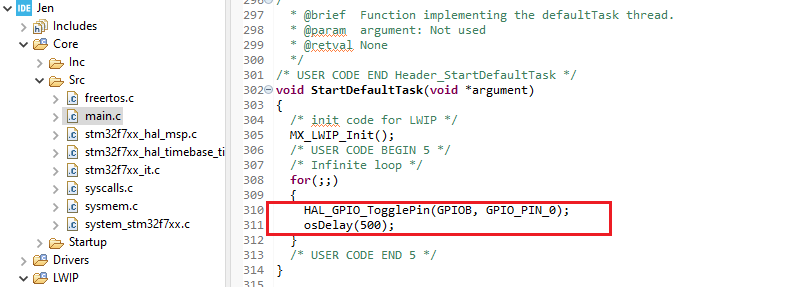</td></tr></table>

### Compile and Debug the Project

22. Select the "Project" | "Build Project" menu item to build the program.

<table><tr><td>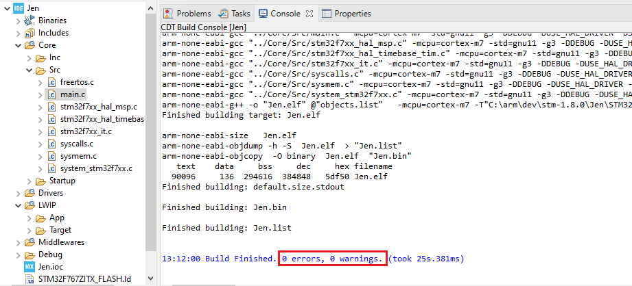</td></tr></table>

23. Select the "Run" | "Debug Configurations" menu option to open the "Debug Configurations" window. Right-click on the "STM32 Cortex-M C/C++ Application" category and select "New Configuration". A new debugging configuration is created.

<table><tr><td>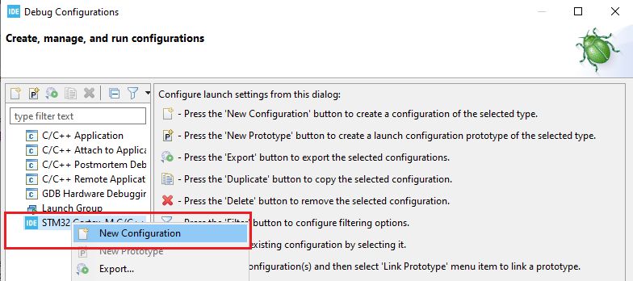</td></tr></table>

24. On the "main" tab of the "Debug Configurations" window, adjust the configuration name appropriately and select the C/C++ Application to be debugged. Here we select the .elf image created when the project was built.

<table><tr><td>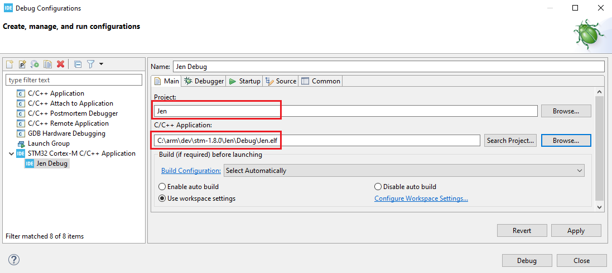</td></tr></table>

25. On the "Debugger" tab of the "Debug Configurations" window, make sure "Autostart local GDB sever" is selected. Make sure the Debug probe is set to "ST-LINK (ST-LINK GDB sever)". Make sure that Interface is set to "SWD". Check the "ST-LINK S/N" checkbox. Click the "Scan" button to locate the attached Nucleo Board and read its serial number. Click "Apply" and "Close" to save and close the debugging configuation.

<table><tr><td>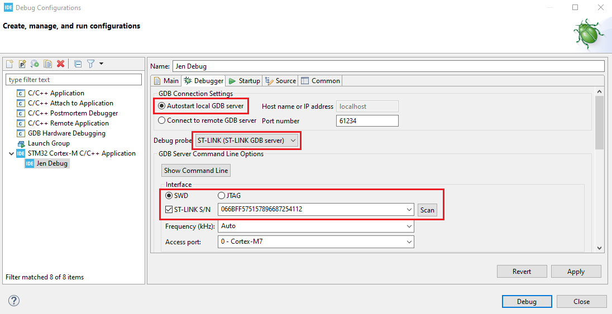</td></tr></table>

26. Select the "Run" | "Debug" menu item. If prompted to update the firmware of the attached ST-LINK, click Yes.  
  
If the STLinkUpgrade engine starts, click "Open in update mode" to enable firmware update. Confirm the existing and new firmware versions. Then click Upgade. Wait for the upgrade to complete and the window to report "Upgrade successful". Click the "X" at the upper-right corner of the "STLinkUpgrade" window to close it. Then select "Run" | "Debug" again to start the debugger.  
  
If Windows opens a Security Alert window and prompts you to allow the st-link_gdbserver.exe program to listen on incoming ports, check both the "Private networks" and "Public networks" checkboxes and click "Allow access".  
  
If prompted to open the "Debug" perspective, click "Switch".

<table><tr><td>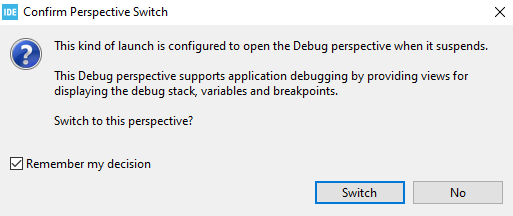</td></tr></table>

27. Confirm the program is at a breakpoint at the first instruction within the main routine.

<table><tr><td>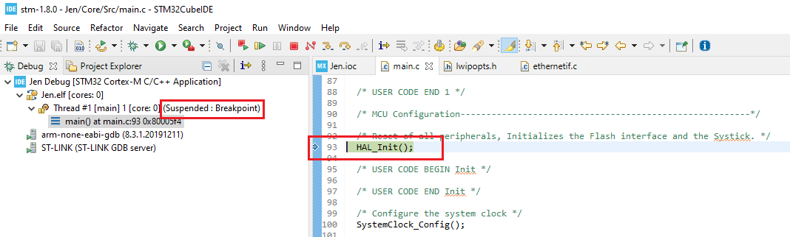</td></tr></table>

28. Place a breakpoint in StartDefaultTask. Step over instructions in main using the F6 key until osKernelStart is called, which should not return. Reach the breakpoint in StartDefaultTask. Step over instructions in StartDefaultTask and observe the HAL_GPIO_TogglePin calls enable/disable the green LED.

<table><tr><td>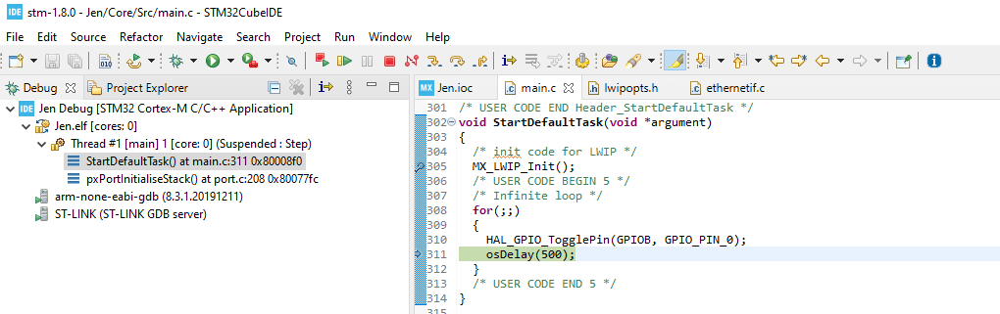</td></tr></table>

29. Press F8 to allow the program to continue running within the debugger. When you are ready, use Ctrl+F2 to terminate the debugger. Before closing the project, use the "Window" | "Perspective" | "Open Perspective" | "Debug" menu option to open the "Debug" explorer. Be sure to "Remove All Terminated Launches" before debugging again.

<table><tr><td>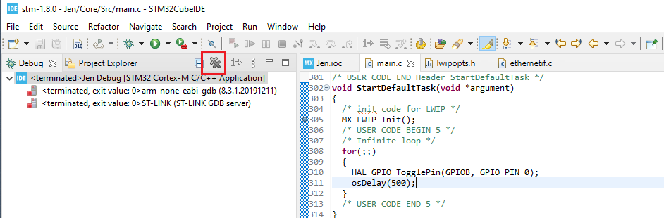</td></tr></table>

30. Use the "Project" | "Close Project" menu item to close the project. Archive your project folder to save your work. We are now ready to replace our sample code with logic to perform network I/O in the next part.
