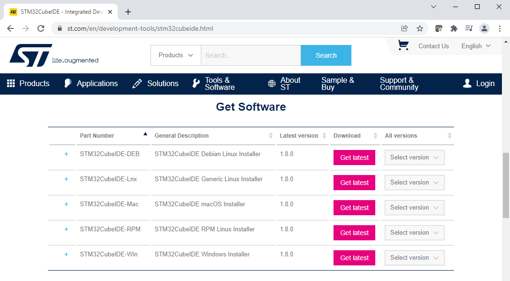
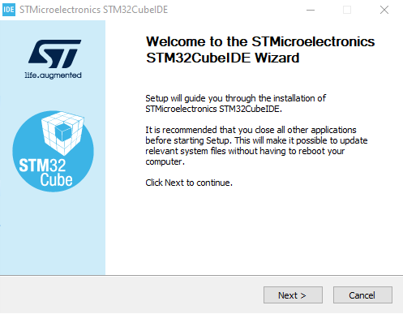
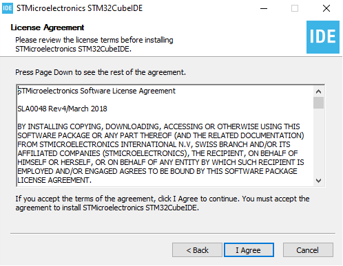
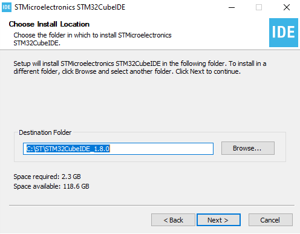
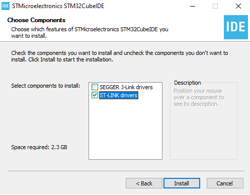
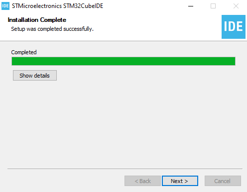
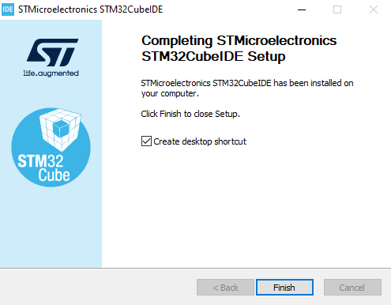
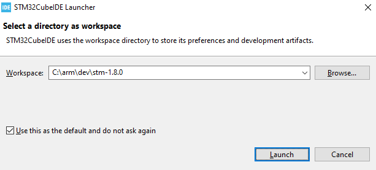
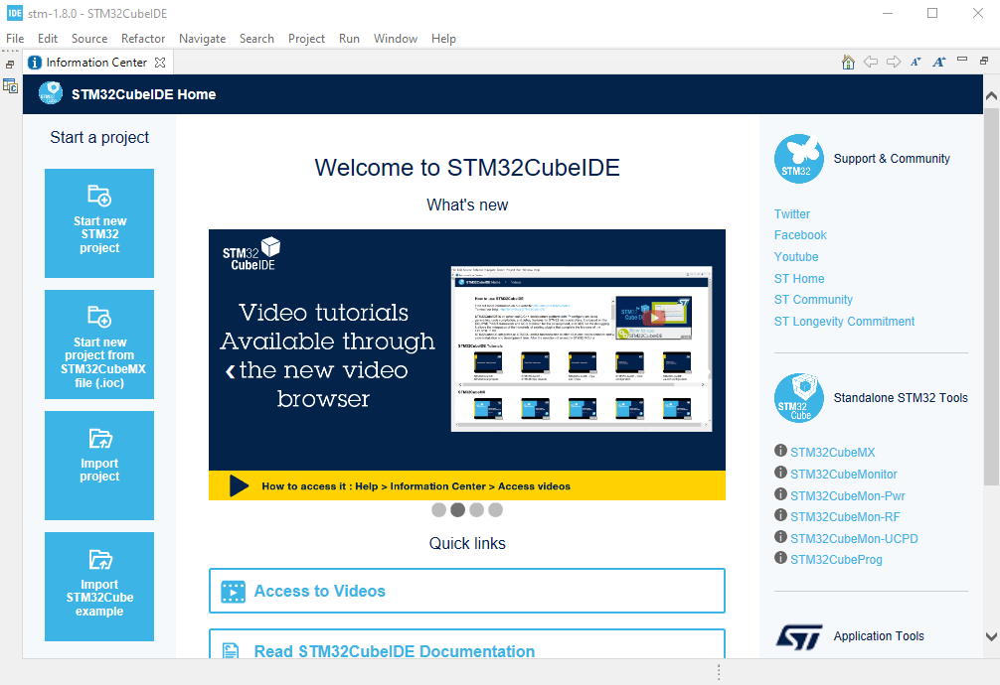

# Install STM32CubeIDE 1.8.0 on Windows 10
If you already have STM32CubeIDE installed and want to reinstall, uninstall STM32CubeIDE first.

## Download STM32CubeIDE Installer
1. Navigate a browser to <a href="https://www.st.com/en/development-tools/stm32cubeide.html">https://www.st.com/en/development-tools/stm32cubeide.html</a>. Scroll down to the "Get Software" section. Click on "Get latest" for the appropriate platform. Here, we're installing on Windows, so we'll download the STM32CubeIDE Windows Installer. If prompted, accept the license agreement and login to your ST Microelectronics account. Having an account is required, but free.

<table><tr><td></td></tr></table>

## Install STM32CubeIDE
2. The downloaded installer here is a compressed archive (.zip). Unzip and run the installer .exe. On the Welcome page, click "Next".

<table><tr><td></td></tr></table>

3. On the License Agreement page, scroll down to read the license agreement and then click "I Agree".

<table><tr><td></td></tr></table>

4. On the Choose Installation Location page, either accept the default installation location or click "Browse..." to locate and select an alternate installation folder. Then click "Next".

<table><tr><td></td></tr></table>

5. On the Choose Components page, we uncheck "SEGGER J-link drivers" and check "ST-LINK drivers". This is because the board we're using is a Nucleo F767 with an onboard ST-LINK. Then click "Install".

<table><tr><td></td></tr></table>

6. When the installation completes, on the Installation Complete page, click "Next".

<table><tr><td></td></tr></table>

7. To complete the installation wizard, we'll leave checked the "Create desktop shortcut" checkbox and click "Finish".

<table><tr><td></td></tr></table>

## Setup STM32CubeIDE

8. Launch STM32CubeIDE. When prompted, choose a folder as the default workspace directory. Here, we use an alternate folder. If you want to use this folder as the default and not be asked again on startup, check the "Use this as the default and do not ask again" checkbox. Then click Launch.

<table><tr><td></td></tr></table>

9. STM32CubeIDE is now installed. STM32CubeIDE is based on Eclipse. In the next part, we will create our program project.

<table><tr><td></td></tr></table>

