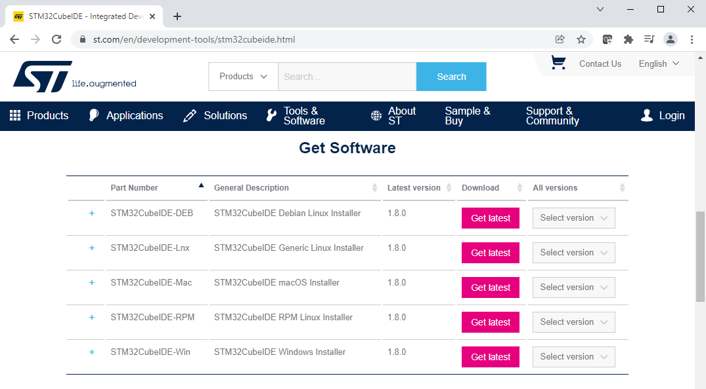

# Install STM32CubeIDE 1.8.0 on Windows 10
If you already have STM32CubeIDE installed and want to reinstall, uninstall STM32CubeIDE first.

## Download STM32CubeIDE Installer
Navigate a browser to <a href="https://www.st.com/en/development-tools/stm32cubeide.html">https://www.st.com/en/development-tools/stm32cubeide.html</a>. Scroll down to the "Get Software" section. Click on "Get latest" for the appropriate platform. Here, we're installing on Windows, so we'll download the STM32CubeIDE Windows Installer. If prompted, accept the license agreement and login to your ST Microelectronics account. Having an account is required, but free.

<table><tr><td></td></tr></table>

## Install STM32CubeIDE
The downloaded installer here is a compressed archive (.zip). Unzip and run the installer .exe.

<table><tr><td></td></tr></table>

Click "Next".

<table><tr><td></td></tr></table>

Click "I Agree".

<table><tr><td></td></tr></table>

Accept the default Destination Folder or select an alternate location. Click "Next".

<table><tr><td></td></tr></table>

Here, we'll be using an STM Nucleo board. Uncheck "SEGGER J-Link drivers". Make sure "ST-LINK drivers" is checked. Click "Install".

<table><tr><td></td></tr></table>

When the installation files have been copied, click "Next".

<table><tr><td></td></tr></table>

Complete the installation by clicking "Finish".

## Setup STM32CubeIDE

Launch STM32CubeIDE. When prompted, choose a folder as the default workspace directory. Here, we use an alternate folder. If you want to use this folder as the default and not be asked again on startup, check the "Use this as the default and do not ask again" checkbox. Then click Launch.

<table><tr><td></td></tr></table>

STM32CubeIDE is now installed. STM32CubeIDE is based on Eclipse. In the next part, we will create the base project for Ayriel.

<table><tr><td></td></tr></table>

