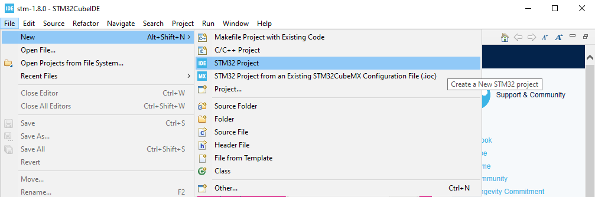
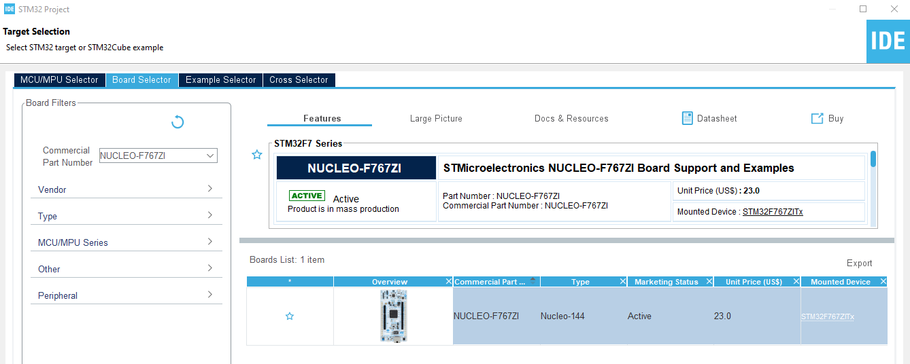
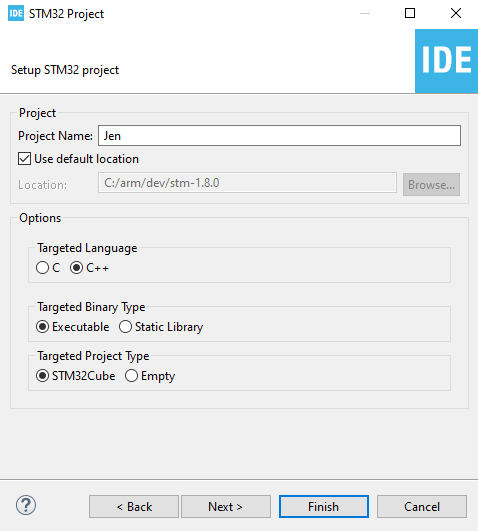
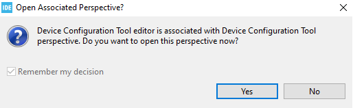
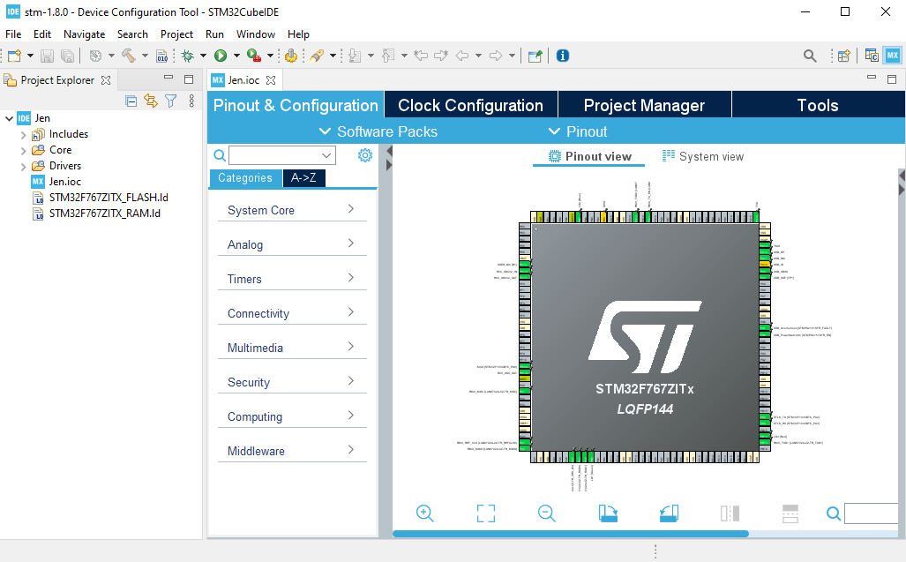

# Create the STM32 Project
## Start the New STM32 Project Wizard

1. Launch STM32CubeIDE. Select the "File" | "New" | "STM32 Project" menu option. This will initiate the download of configuration data to support the STM32Cube tool. This might take minute or more to complete.

<table><tr><td></td></tr></table>

2. When the STM32Cube tools is ready, it will launch the Target Selection window. Here, click on the Board Selector tab and enter the Commercial Part Number of the development board being used. Here we are using a NUCLEO-F767ZI. The value entered in the Commercial Part Number field will automatically filter the Boards List. Select the desired board in the Boards List and then click "Next".

<table><tr><td></td></tr></table>

3. In the "STM32 Project" dialog, we enter the project name and will accept the default workplace location. We select "C++" as the targeted language. The Targted Binary Type is Executable. The Targeted Project Type is STM32Cube. We'll accept the default options on the final page of this wizard, so we can click "Finish" here.

<table><tr><td></td></tr></table>

4. If asked whether to initialize all peripherals with their default Mode, answer Yes.

<table><tr><td></td></tr></table>

5. If prompted to open the Device Configuration Tool prespective, answer Yes.

<table><tr><td></td></tr></table>

6. The device configuration tool will now download packages specific to the development board we selected. This can take a few minutes. When the download completes, the project will be initialized and its IOC file will be opened at the default "Pinout & Configuration" tab. Now we are ready to configure the device and project settings.

<table><tr><td></td></tr></table>

